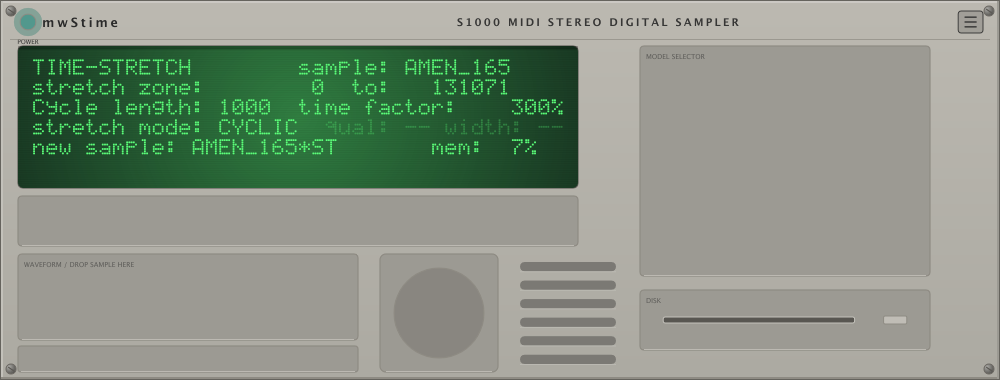
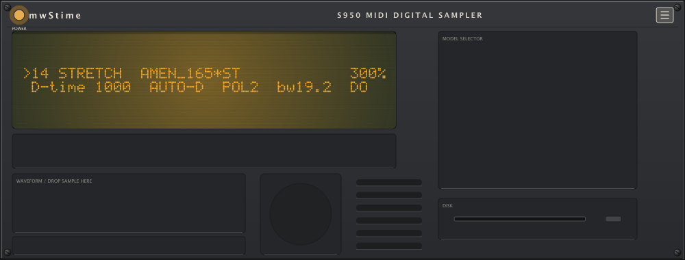
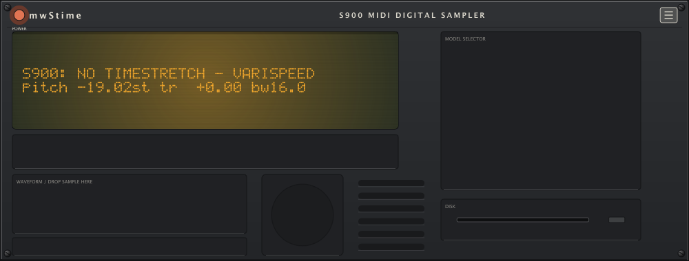
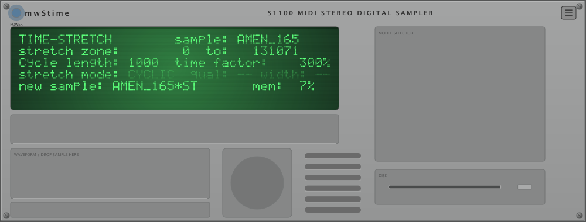
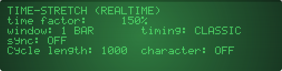

<!-- SPDX-License-Identifier: AGPL-3.0-or-later -->
<!-- mwStime — Akai S-series timestretch emulation. Copyright (C) 2026 mattWoolly. -->

# mwStime

**mwStime** is a cross-platform audio plugin (VST3 / AU / CLAP / LV2 + standalone
app) that faithfully emulates the timestretch of the **Akai S-series samplers** —
S900, S950, S1000, S1100 — with a skeuomorphic S-series control panel and
per-model character switching. It is the era-correct grit of late-80s/early-90s
hardware stretching (the jungle / IDM / breakbeat sound) in a modern host, plus
a real-time FX mode the hardware never had.

- **Authentic DSP core** — era-correct artifacts, per-model bit depth, variable
  sample-clock and reconstruction-filter character.
- **Modern UX** — real-time preview, host tempo sync, drag-and-drop, resizable
  vector UI.
- **Open source, AGPLv3** — JUCE 8, CMake (FetchContent), no submodules.

> **Honesty first.** Where we know the hardware behavior from manuals or service
> data, we say so. Where a value is invented because the original is
> unrecoverable, it is labeled. See [Authenticity statement](#authenticity-statement).

---

## What it does

The Akai timestretch is, on the hardware, an **offline render to a new sample**:
you load audio, set a time factor and a cycle length, press GO, and the sampler
builds a new, longer-or-shorter sample by splicing repeated/dropped grains.
mwStime reproduces that workflow exactly (**SAMPLE mode**) and also wraps the same
grain scheduler in a streaming engine so you can use it as a live insert
(**FX mode**, the default).

The two modes share one grain scheduler, so they sound identical under equal
settings — the difference is *when* the audio is processed and what physics
applies (see [FX mode vs SAMPLE mode](#fx-mode-vs-sample-mode)).

---

## Models

Each model is a distinct **character chain** (bit depth, sample-clock behavior,
reconstruction filter) over a shared stretch engine. v1 ships four models; the
S3000 ships in **v1.1** (its data slot is already reserved).

| Model | Year | Stretch | Character |
|---|---|---|---|
| **S900** | 1986 | **None — varispeed only** | 12-bit, variable clock 7.5–40 kHz, pitch-tracking Butterworth LPF |
| **S950** | 1988 | Up to **999%**, D-TIME, Mon1/Pol2 | 12/16-bit, variable clock 7.5–48 kHz, tracking Butterworth LPF (mono engine) |
| **S1000** | 1988 | **25–2000%** (CYCLIC) | 16-bit, fixed 44.1 / 22.05 kHz, -18 dB/oct voice LPF |
| **S1100** | 1990 | 25–2000% (same engine as S1000) | as S1000; 20-bit DAC, slightly lower noise floor |
| **S3000** | 1992 | 25–2000% — **coming in v1.1** | 16-bit ADC 64×OS, 28-bit accumulation, -12 dB/oct resonant moving LPF |

### The S900 had no timestretch

This is not an omission — it is the truth of the machine. The S900 operator's
manual contains **zero** occurrences of "stretch". The only later addition (OS 4.0
TIME SKEW) is not a pitch-preserving stretch. So **S900 mode is honest varispeed
repitch**: the time factor maps to playback rate and pitch follows (the LCD shows
the resulting semitone offset), through the genuine 12-bit / variable-clock /
tracking-filter character chain. The LCD states it plainly:
`S900: NO TIMESTRETCH — VARISPEED`. Stretch-only fields are hidden on the S900
faceplate.

Want S900-flavored grit *with* real stretching? Select the **S950** — it has the
12-bit chain *and* a real cyclic stretch engine. (Decision record:
[`plan/decisions/003-s900-mode-semantics.md`](plan/decisions/003-s900-mode-semantics.md).)

### INTELL arrives in v1.1

The S1000/S1100 hardware offers two stretch algorithms: **CYCLIC** (shipping) and
**INTELL** (intelligent). INTELL's internals are entirely unverified, so shipping a
guess under the "authentic" name would be dishonest. At v1 the `QUAL` and `WIDTH`
fields (INTELL-only parameters) appear **greyed with an "INTELL only" note**,
exactly as the hardware manuals scope them — the UI documents its own gap. INTELL
is a v1.1 fast-follow.

---

## FX mode vs SAMPLE mode

mwStime is **FX-first**: FX mode is the default. The honest split is *"what the
hardware did"* (SAMPLE) vs *"what the hardware never could"* (FX), with the same
sonic character from the shared scheduler.

### SAMPLE mode — the authentic workflow

Load/drop a file → edit parameters with a live zone preview → press **GO** to
render offline (progress + remaining-time readout, hold **F8** to abort) →
audition / A-B against the original → drag the result out as a WAV. Renders are
deterministic, and **normalization defaults OFF** (authentic: no manual documents
normalization). This is the path the golden regression tests pin down.

### FX mode — real-time, and the causality contract

A live streaming stretcher cannot break physics, and mwStime does not pretend
otherwise. At wall-clock time *t* the plugin has received exactly *t* seconds of
input, so:

- **Time factor = 100%** is a pure delay of exactly the reported latency. With
  CHARACTER OFF this nulls against a delayed dry signal.
- **Time factor > 100%** (expansion) is causal: the read head lags the write head,
  growing without bound. mwStime bounds it with a 30-second history; on exhaustion
  the read head resyncs at the next grain boundary (an audible, documented jump).
- **Time factor < 100%** (compression) needs future input — impossible as a pure
  insert. In **FREE** mode it is **clamped to 100%** and the LCD shows
  `FX MIN 100%` (your automation value is preserved; only the engine clamps). In
  **SYNC** mode the captured window plays compressed, then silence to the window
  boundary.

**SYNC windows** (1/4 … 8 bars, default 1 bar) tie the engine to host transport
for "stretch the last bar" / beat-repeat behavior; expansion hard-resyncs to the
window start at each transport-aligned boundary.

**Latency** is `ceil(2000 × hostRate / modelRate) + crossfade + SRC group delay`,
recomputed when model / bandwidth / sample-rate change (these are *not*
automatable). Switching models updates reported latency — a host PDC-updating
action, and hosts honor mid-session latency changes inconsistently.

Full contract: [`plan/decisions/006-fx-vs-sample-mode.md`](plan/decisions/006-fx-vs-sample-mode.md)
and [architecture §5.2](docs/design/architecture.md).

---

## Formats & host notes

| Format | Platforms | Notes |
|---|---|---|
| **VST3** | macOS, Linux (Windows later) | categorized as an effect with a MIDI input bus |
| **AU (v2)** | macOS | exported as **`aumf` (music effect)** so Logic routes MIDI to it |
| **LV2** | Linux (primary), macOS | native JUCE 8 LV2 export |
| **CLAP** | all | via `clap-juce-extensions` |
| **Standalone** | all | dev/debug vehicle and open Akaizer-style desktop tool |

**Logic Pro:** mwStime registers as a **music effect** (`aumf`), not an
instrument — insert it on an audio track and you may also drive audition with
MIDI. Hosts that refuse MIDI to effect slots degrade gracefully: audition is
always available from the UI (PLAY soft key / clicking the waveform); MIDI repitch
is an enhancement, never the only trigger path.

**MIDI repitch** is monophonic, last-note priority at v1 (root C3, chromatic).

Windows is the third platform goal and is not part of the v1 build matrix yet.

---

## Screenshots

The UI is fully **procedural vector graphics** (no bitmap skins), so it stays
crisp at any scale. These are the blessed UI-regression renders on macOS:

| | |
|---|---|
| S1000 faceplate |  |
| S950 faceplate |  |
| S900 faceplate (varispeed) |  |
| S1100 faceplate |  |
| FX real-time LCD page |  |

(Generated on macOS by the UI screenshot-regression suite; see
[`tests/ui/blessed/`](tests/ui/blessed/).)

---

## User manual

Step-by-step instructions, the full parameter reference, and troubleshooting live
in **[docs/MANUAL.md](docs/MANUAL.md)**.

---

## Build from source

mwStime is JUCE 8 + CMake (FetchContent). The pure DSP core
(`libs/mwstime-core`) is JUCE-free and builds with any C++20 compiler; only the
`plugin/` layer pulls JUCE. CMake ≥ 3.25.

```sh
git clone https://github.com/mattWoolly/mwStime
cd mwStime
cmake --preset default
cmake --build --preset default -j 6
ctest --preset default
```

That configures, builds (VST3 / AU / LV2 / CLAP / Standalone on macOS), and runs
the unit + golden-render + property test suites. To share the FetchContent
download cache across checkouts, add
`-DFETCHCONTENT_BASE_DIR="$HOME/.cache/mwstime-fc"` to the configure step.

Linux prerequisites and the full per-platform matrix (including format-validator
tooling and golden-tolerance policy) are in **[docs/BUILDING.md](docs/BUILDING.md)**.

---

## Authenticity statement

mwStime aims for an honest emulation, not marketing fiction. Every claim is one
of three things, and we keep them distinct:

- **Research-pinned** — traceable to an Akai manual or service-grade data: the
  model character chains (12-bit variable-clock path; fixed-rate 16-bit voice
  filter), the offline render / GO / abort / memory-cap workflow, the parameter
  ranges and units shown on the LCD, the S900-has-no-timestretch fact, and the
  mono-sum behavior of the S900/S950.
- **Pragmatic invention (PI)** — a defensible default chosen where the original
  is undocumented or unrecoverable: the cycle-length numeric range (Akaizer's
  convention), the grain crossfade overlap fraction, the FX 30-second history and
  window set, auto-cycle detection, and the MIDI repitch behavior. Each (PI)
  value carries a tuning note in the design docs.
- **Deliberate deviation** — where we intentionally differ from the hardware,
  recorded in an ADR. The biggest is **FX mode itself**: real-time streaming with
  the bounded causality deviations of
  [ADR-006](plan/decisions/006-fx-vs-sample-mode.md). FX mode's LCD page reads
  `TIME-STRETCH (REALTIME)` — deliberately non-hardware wording so you always
  know when you have left authentic territory.

**The word "authentic" is gated on hardware.** The splice fine structure (the
crossfade shape and exact step formula) is *the sound* and is not recoverable
without disassembly. Until the model character is calibrated against real
hardware captures, "authentic" labeling is provisional — Akaizer renders are only
a secondary local cross-check, never the oracle. The calibration plan is QA
Wave 2 ([testing-strategy §7](docs/design/testing-strategy.md)).

---

## License

mwStime is licensed **AGPL-3.0-or-later** — see [LICENSE](LICENSE). The full JUCE
build is GPL-compatible with Steinberg's GPLv3 VST3 option. If you run a modified
version as a network service, the AGPL requires you to offer the corresponding
source to its users.

---

## Credits & citations

mwStime stands on documented research. The DSP claims trace to:

- **Akai manuals & hardware specs** —
  [`docs/research/akai-manuals-specs.md`](docs/research/akai-manuals-specs.md)
- **Akaizer reverse-engineering analysis** (OpenMPT / Akaizer scheduling) —
  [`docs/research/akaizer-analysis.md`](docs/research/akaizer-analysis.md)
- **Deep-research report** (adversarially verified, cited) —
  [`docs/research/deep-research-report.md`](docs/research/deep-research-report.md)

Design rationale lives in [`docs/design/`](docs/design/) and the architecture
decision records in [`plan/decisions/`](plan/decisions/). The cross-check
methodology and hardware-capture plan are in [`docs/qa/`](docs/qa/).

Built with [JUCE 8](https://juce.com/). Prior art and inspiration: Akai's own
firmware, the OpenMPT timestretch, and the Akaizer / RX950 community tools.
